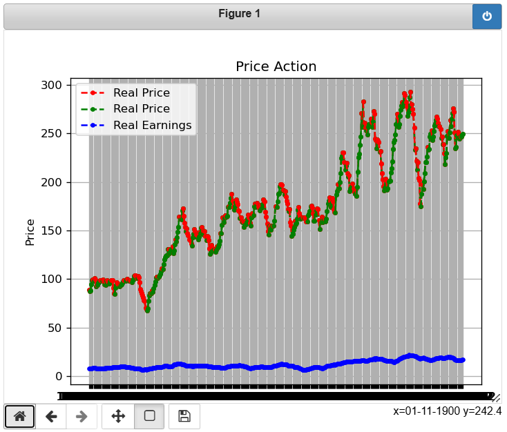
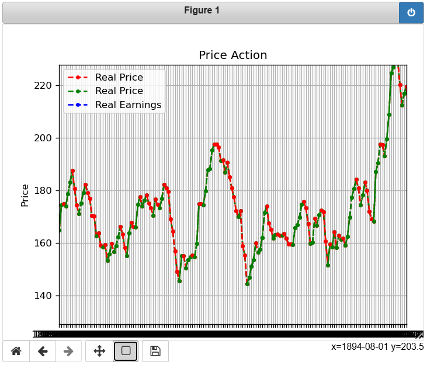
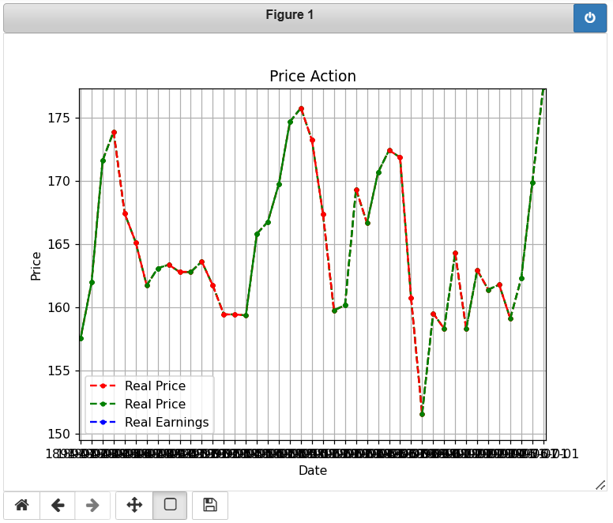

# **Interactive Time Series Plot with Dynamic Price Action Visualization**

## **Project Description**  
This project visualizes historical financial data trends (e.g., Real Price and Real Earnings) over time. Using **Matplotlib**, the program dynamically adjusts plot colors to highlight price movements (up/down) and provides interactive visualization which provides a clear understanding of data trends. The solution aims to help users analyze **time series data** effectively.

---

## **Problem Statement**  
Develop a **time series data visualization** for financial metrics with the following features:  
1. **Dynamic Price Movement Colors**: Visualize changes in "Real Price" where upward trends are marked in **green** and downward trends in **red**.  
2. **Additional Metrics**: Overlay a secondary trendline (e.g., "Real Earnings") to allow users to compare trends over time.  
3. **Grid Alignment and Legends**: Enhance visualization clarity with grids, labeled axes, legends, and titles.  
4. **Interactive Extension** (Optional): Provide **zooming** and **panning** functionalities using libraries like Plotly or Bokeh for an interactive exploration of the data.

---

## **Dataset**  
The dataset `data_csv.csv` contains historical financial data with the following columns:  
- **Date** (Index): Time-based data.  
- **SP500**: S&P 500 index value.  
- **Dividend**: Dividend amount.  
- **Earnings**: Earnings value.  
- **Consumer Price Index**: CPI data.  
- **Long Interest Rate**: Interest rate over time.  
- **Real Price**: Adjusted real price of the stock.  
- **Real Dividend**: Adjusted real dividend.  
- **Real Earnings**: Adjusted real earnings.  
- **PE10**: Price-to-earnings ratio over 10 years.  

---

## **Output**:






---

## **How to Run**  
Follow these steps to run the project:  

1. **Clone this repository**:  
   ```bash
   git clone https://github.com/your_username/interactive-time-series-plot.git

2. **Install required libraries**:
   ```bash
   pip install pandas matplotlib
   
3. **Prepare your dataset**:
   Place your dataset `data_csv.csv` in the project directory.
   
4. **Run the script**:
   ```bash
   python interactive_plot.py
   
5. **View the Output**:
   A time series plot will appear showing the trends of "Real Price" and "Real Earnings".

---

## **Future Enhancements**  
- Add dropdown selectors to choose different financial metrics dynamically.  
- Implement a time-range slider for improved data filtering.

---

## **Conclusion**
This project provides a clear and dynamic visualization of time series data, helping users analyze financial trends effectively. Also incorporated with interactive features which provides more engaging and flexible data exploration capabilities.
